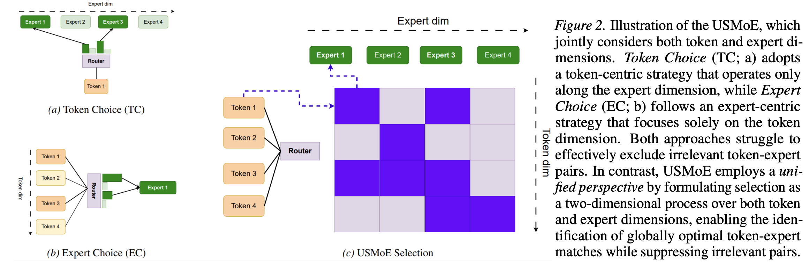

# USMoE

Official code for the ICML 2026 paper **"Rethinking Sparse Mixture of Experts
from a Unified Perspective"**.

<p align="center">
  
</p>

<p align="center">
  <em>Overview of the USMoE framework.</em>
</p>

## Abstract

Sparse Mixture of Experts (SMoE) models scale the capacity of models while
maintaining constant computational overhead. SMoE methods fall into two
categories: Token Choice, which routes each token to a fixed number of experts,
and Expert Choice, which assigns a fixed number of tokens to each expert.
However, the use of fixed budgets for tokens or experts causes both approaches
to select irrelevant token-expert pairs or overlook critical assignments, which
degrades overall performance. To fill that gap, we rethink SMoE from a unified
perspective through the lens of linear programming, which provides a general
formulation for SMoE models. Furthermore, we introduce Unified Sparse Mixture
of Experts (USMoE), a novel framework comprising a unified mechanism and a
unified score to overcome these limitations. We provide both theoretical
justification and empirical evidence demonstrating USMoE's effectiveness.
Extensive evaluations across diverse data settings (clean and corrupted),
multiple domains (including texts and vision tasks), and different learning
approaches (training-free and training-based) show that USMoE not only delivers
significant performance improvements over existing SMoE methods, but also
enables more flexible expert selection budgets, reducing inference costs
without compromising model performance.

## Experiments

- **Training from scratch**: Transformer-XL style language modeling experiments
  with custom sparse MoE gates.
- **Training-free evaluation**: using hidden states (HS) and routing weights
  (RW) from pretrained MoE language models as text embeddings, evaluated on
  MTEB tasks.

## Repository Layout

| Path | Description |
| --- | --- |
| `USMoE/Training_scratch/` | Training-from-scratch code for language modeling experiments. |
| `USMoE/Training_scratch/run_exp.sh` | Default enwik8 training entry point. |
| `USMoE/Training_scratch/script/table1/transformer_xl/baselines/SMoE/` | Dataset-specific scripts for enwik8, text8, WikiText-103, and One Billion Words. |
| `USMoE/Training_Free/` | Training-free evaluation code for pretrained MoE models. |
| `USMoE/Training_Free/eval_mteb.py` | MTEB evaluation entry point. |
| `USMoE/Training_Free/run_exp.sh` | Default OLMoE evaluation script. |
| `USMoE/Training_Free/models/` | Modified model implementations for DeepSeek-MoE, Qwen-MoE, and OLMoE. |

## Environment

Create a Python environment first:

```bash
conda create -n usmoe python=3.10
conda activate usmoe
```

For training-free MTEB evaluation:

```bash
pip install torch transformers bitsandbytes scikit-learn tqdm
```

For training from scratch, install the language-modeling dependencies and
FastMoE:

```bash
pip install torch transformers numpy dm-tree
pip install git+https://github.com/laekov/fastmoe.git
```

`apex` is only needed when running the scratch code with `--fp16`.

## Data and Checkpoints

The training-from-scratch scripts expect datasets at the paths used in the
shell scripts:

- `USMoE/Training_scratch/data/enwik8`
- `USMoE/Training_scratch/data/text8`
- `USMoE/Training_scratch/data/one-billion-words`
- `/data/wikitext-103` for the WikiText-103 script

The training-free scripts load pretrained checkpoints from Hugging Face. Make
sure the target checkpoint is accessible in your environment before running the
evaluation.

## Training-Free Evaluation

Run the default OLMoE MTEB evaluation:

```bash
cd USMoE/Training_Free
bash run_exp.sh
```

This script evaluates `allenai/OLMoE-1B-7B-0924` across the configured MTEB task
types with `HS` embeddings and the `none` / `prompteol` embedding prompts.
Results are written under `mteb_results_ablation_test1/`.

Example single-task run:

```bash
cd USMoE/Training_Free
python eval_mteb.py \
  --base_model allenai/OLMoE-1B-7B-0924 \
  --use_4bit \
  --task_types STS \
  --batch_size 128 \
  --emb_info RW \
  --embed_method none
```

Supported pretrained MoE backbones include:

- `deepseek-ai/deepseek-moe-16b-base`
- `Qwen/Qwen1.5-MoE-A2.7B`
- `allenai/OLMoE-1B-7B-0924`

Important options:

- `--emb_info HS`: use hidden states as embeddings.
- `--emb_info RW`: use MoE routing weights as embeddings.
- `--embed_method none`: evaluate without an additional prompt template.
- `--embed_method prompteol`: evaluate with the PromptEOL-style template.
- `--task_types`: comma-separated MTEB task types.
- `--task_names`: comma-separated MTEB task names.

## Training From Scratch

Run the default enwik8 experiment:

```bash
cd USMoE/Training_scratch
bash run_exp.sh
```

Additional dataset scripts are available:

```bash
cd USMoE/Training_scratch
bash script/table1/transformer_xl/baselines/SMoE/enwik8_smoe.sh
bash script/table1/transformer_xl/baselines/SMoE/text8_smoe.sh
bash script/table1/transformer_xl/baselines/SMoE/wik103_smoe.sh
bash script/table1/transformer_xl/baselines/SMoE/lm1b_smoe.sh
```

The default scripts use `CustomNaiveGate_Balance_SMoE` with 16 experts and
top-2 routing. You can change the routing setup through options such as
`--gate_name`, `--moe-num-expert`, `--moe-top-k`, and `--load_balance`.

## Citation

If you find this repository useful, please cite our paper:

```bibtex
@misc{do2026rethinkingsparsemixtureexperts,
  title={Rethinking Sparse Mixture of Experts from a Unified Perspective},
  author={Giang Do and Hung Le and Truyen Tran},
  year={2026},
  eprint={2503.22996},
  archivePrefix={arXiv},
  primaryClass={cs.CL},
  url={https://arxiv.org/abs/2503.22996},
}
```
